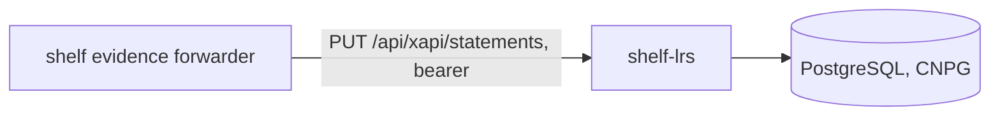

# Shelf learning record store


The learning record store for Shelf (LORB on Cookie): the durable end of the evidence trail. It
speaks the xAPI statements resource, stores every accepted statement immutably (enforced by a
database trigger), treats a redelivery as a no-op, and refuses an actor that identifies a person,
because the evidence chain is pseudonymous by construction and a record store is where that would
leak. It has a database of its own: a restore of the platform's database must not roll back the
record of what a learner did.

The xAPI resources are served under `/api/xapi/`, the prefix the platform's sign-in gateway passes
through, because the evidence forwarder authenticates with a bearer token rather than a browser
session. `GET /health` stays at the root for the platform's probe.

## Intended users

| Who | What they do here |
| --- | --- |
| The `shelf` evidence forwarder | `PUT /api/xapi/statements?statementId=…` with a bearer token |
| Analysts | `GET /api/xapi/statements` with a bearer token |

## Architecture



## Running locally

```sh
pnpm install
LRS_ACCEPTED_BEARER_TOKENS=$(openssl rand -hex 32) pnpm serve:lrs
```

## Environment variables

| Variable | Notes |
| --- | --- |
| `DATABASE_URL` | *platform*; read as the fallback for `LRS_DATABASE_URL` |
| `LRS_ACCEPTED_BEARER_TOKENS` | Secret; comma-separated tokens the store accepts |
| `LRS_PATH_PREFIX` | `/api/xapi`, set in the image |
| `PORT` | `8080`, set in the image |

## Contributors

| Name | Role |
| --- | --- |
| Paul Coyne | Business owner |

## Contributing and access

Changes are made in the LORB repository and exported here with `deploy/cookie/export.sh`. Pearson
proprietary internal software.
