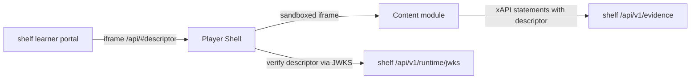

# Shelf player


The Player Shell for Shelf (LORB on Cookie), with the bundled content packages: the shared quiz,
video, document, audio and e-book players and the example modules. Static files served by a small
Node server under `/api/`, the one path prefix the platform's sign-in gateway leaves unauthenticated.
That is a requirement, not a convenience: a module runs in an iframe sandboxed without
`allow-same-origin`, holds no cookies, and can never sign in.

Every file is served with `Access-Control-Allow-Origin: *`, which is why this is its own app: that
header must never be on the API's origin. Nothing here is authenticated, nothing here is personal,
and nothing here is written.

## Intended users

| Who | What they do here |
| --- | --- |
| Learners | Never directly: the learner portal embeds this shell in an iframe when an activity is launched |

## Architecture



## Running locally

```sh
pnpm install
pnpm --filter player-shell build && pnpm --filter quiz-player build
PLAYER_WWW_ROOT=packages/player-shell/dist node server.mjs
```

## Environment variables

| Variable | Notes |
| --- | --- |
| `PORT` | `8080`, set in the image |
| `PLAYER_BASE_PATH` | `/api`, set in the image |

## Contributors

| Name | Role |
| --- | --- |
| Paul Coyne | Business owner |

## Contributing and access

Changes are made in the LORB repository and exported here with `deploy/cookie/export.sh`. Pearson
proprietary internal software.
