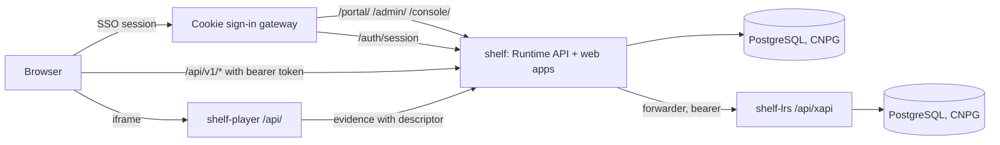

# Shelf


Shelf is the Learning Object Repository and Broker (LORB) running on Cookie: an independent
repository of learning objects and players that lets product teams build experiences, register
them, and make them available for launch in learning platforms. A consumer asks it for a launch; it
answers with a short-lived signed descriptor naming exactly one immutable version of one piece of
content, hosts that content in a sandboxed player, holds the attempt's state, and delivers the
resulting xAPI evidence to a learning record store. It is not an LMS, does not author content, and
issues no identities of its own.

This repository is the logic tier and the browser tier of that deployment: the Runtime API with the
Evidence API, the evidence forwarder, and the three browser applications it serves. The Player Shell
(`shelf-player`) and the learning record store (`shelf-lrs`) are separate apps. The source of truth
for the code is the LORB repository; this tree is exported from it by `deploy/cookie/export.sh`.

## Intended users

| Who | What they do here |
| --- | --- |
| Product teams | Register and version learning objects and players through the Administration workspace at `/admin/` |
| Teachers | Manage classes and assignments, and read results, in the learner portal at `/portal/` |
| Learners | Browse a course and launch an activity from `/portal/` |
| Operators | Read operational projections and issue test launches at `/console/` |

## Features

- Launch brokering: `POST /api/v1/runtime/launches` returns a JWS descriptor valid for minutes,
  naming the object and package version explicitly.
- A sandboxed player on its own origin, talking to the module over a nonce-authenticated channel.
- Evidence acceptance separated from delivery: statements land in a durable outbox and are forwarded
  with retry, backoff and dead-lettering.
- Administration with separation of duties, an append-only audit trail, and repository-scoped access.
- Publishing: register, version, suspend, retire and delete learning objects; evidence outlives the
  catalogue.
- Pseudonymous by construction: the only learner identifier stored is an HMAC of the provider's
  subject under a tenant secret.

## Architecture



## Running locally

Node 20 or later and pnpm 9.

```sh
cp .env.example .env
pnpm install
docker compose up -d postgres
pnpm db:setup
pnpm dev
```

`pnpm dev` runs with development conveniences (an ephemeral signing key, the bundled example
catalogue, a development identity provider), each of which is refused when `NODE_ENV` is
`production`. `pnpm typecheck` and `pnpm test` run the checks; several tests need Postgres.

## Environment variables

Set through the Cookie portal. Values marked *platform* are injected and must not be set by hand.

| Variable | Notes |
| --- | --- |
| `DATABASE_URL` | *platform* |
| `OIDC_ISSUER`, `OIDC_CLIENT_ID` | *platform*; issuer and audience for token verification |
| `OIDC_ALGORITHMS` | `RS256` |
| `OIDC_ROLE_CLAIM` | `groups` |
| `ADMIN_ALLOWED_ROLES` | The group whose members may administer |
| `OIDC_PLATFORM_ADMIN_CLAIM` | `groups=<group>` |
| `RUNTIME_PUBLIC_ISSUER` | This app's own `https://` origin |
| `PLAYER_SHELL_ORIGIN`, `PLAYER_SHELL_BASE_PATH` | The `shelf-player` origin and `/api` |
| `ALLOWED_CONSUMER_ORIGINS` | Exact origins allowed to call the API from a browser |
| `PSEUDONYM_TENANT_SECRET` | Secret, 32 bytes hex. Changing it re-pseudonymises every learner |
| `DESCRIPTOR_PRIVATE_KEY_PEM`, `DESCRIPTOR_KID` | Secret; the descriptor signing key |
| `RUNTIME_INTERNAL_SERVICE_TOKEN` | Secret, 32+ characters |
| `LRS_ENDPOINT`, `LRS_BEARER_TOKEN` | The `shelf-lrs` origin plus `/api/xapi`, and its token (secret) |

`PORT=8080`, `NODE_ENV=production`, `SERVE_WEB_APPS=true` and `PLATFORM_SESSION_ENDPOINT=true`
are set in the image. `GET /health` is the liveness probe; `GET /ready` checks the database and the
signing key.

## Contributors

| Name | Role |
| --- | --- |
| Paul Coyne | Business owner |

## Contributing and access

Access is managed through the Cookie portal. Changes are made in the LORB repository and exported
here; the full deployment procedure is in `docs/runbooks/cookie-deployment.md`. This is Pearson
proprietary internal software.
